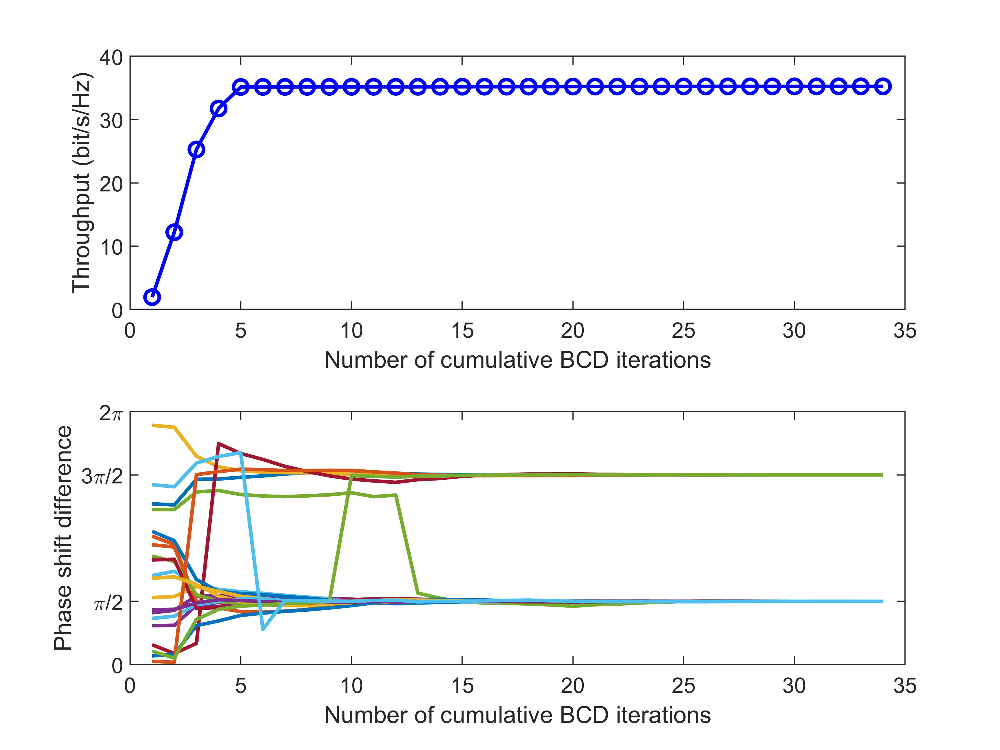

# Coupled Phase-Shift STAR-RISs: A General Optimization Framework

The code for the paper 
**Z. Wang, X. Mu, Y. Liu, and R. Schober, “Coupled phase-shift STAR-RISs: A general optimization framework,” *IEEE Wireless Commun. Lett.*, vol. 12,
no. 2, pp. 207-211, Feb. 2023, doi: 10.1109/LWC.2022.3219020.** [[IEEE](https://ieeexplore.ieee.org/abstract/document/9935266)] [[Arxiv](https://arxiv.org/abs/2208.01942)]

In this paper, we proposed a general optimization framework to solve the coupled phase-shift constraint of the passive lossless STAR-RIS. The proposed framework can be used as an add-on scheme. In other words, **if you have designed an algorithm for the independent phase-shift STAR-RIS with respect to a specific problem, you can directly extend this algorithm to the case of coupled phase-shift STAR-RIS.**

## Running the simulations

### Prerequisites

- [MATLAB](https://uk.mathworks.com/products/matlab.html)
- [CVX](http://cvxr.com/cvx/)

### Launch

Run `main.m`

### Expected Results

#### Convergence of the Proposed Algorithm


## Citing
If you in any way use this code for research, please cite our original article listed above. The corresponding BiBTeX citation is given below:
```
@article{wang2022coupled,
  title={Coupled Phase-Shift {STAR-RIS}s: A General Optimization Framework},
  author={Wang, Zhaolin and Mu, Xidong and Liu, Yuanwei and Schober, Robert},
  journal={{IEEE} Wireless Commun. Lett.},
  volume={12},
  number={2},
  pages={207--211},
  year={2023},
  month=feb,
  publisher={IEEE}
}
```
